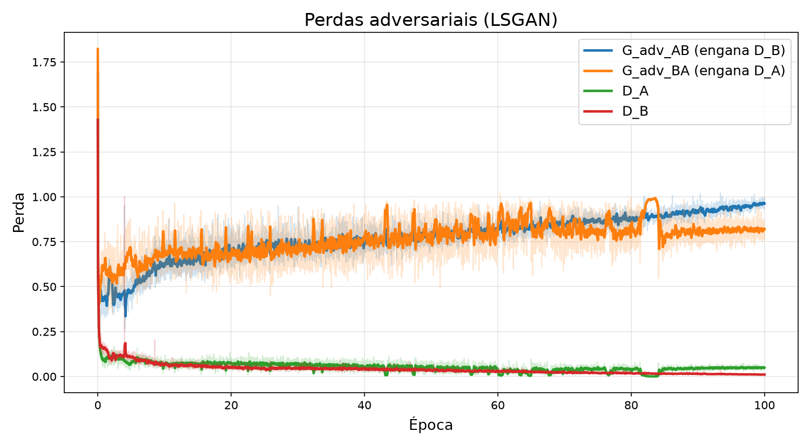
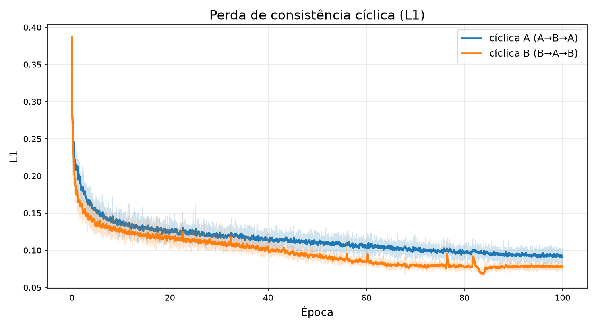
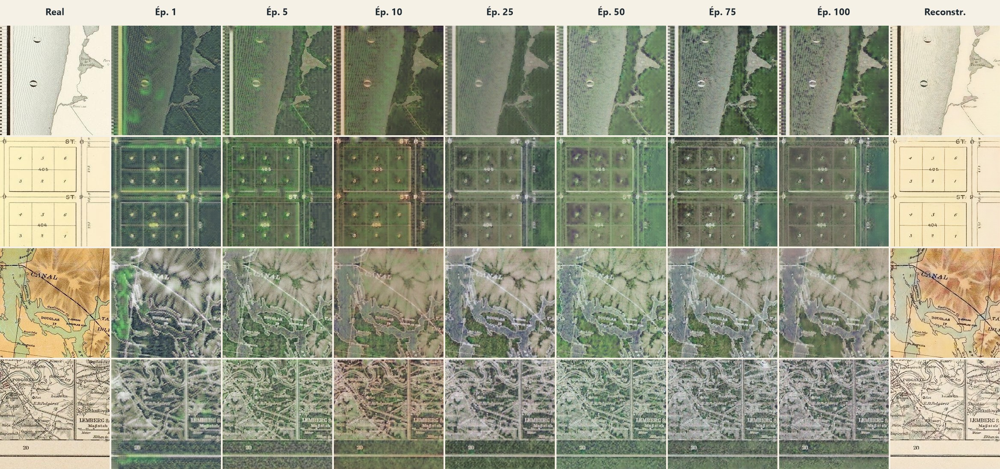
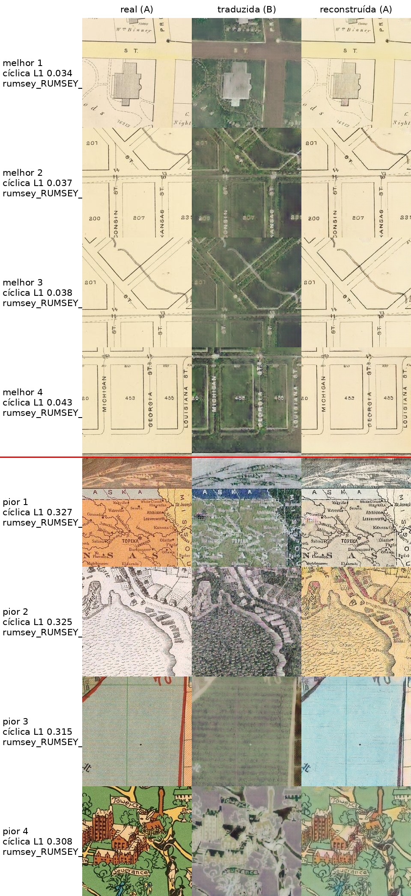
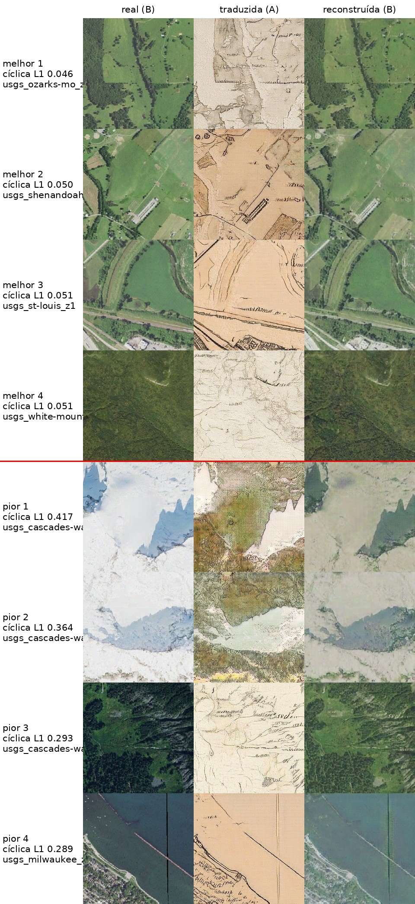

# CycleGAN: mapas históricos ↔ imagens de satélite

Trabalho da disciplina de Aprendizado Não-Supervisionado (PUCRS, Prof. Luan Garcia). Implementamos e treinamos do zero uma CycleGAN para tradução de imagens **não pareada** e analisamos criticamente os resultados.

Para reproduzir o treino, veja [COMO_RODAR.md](COMO_RODAR.md).

## Tradução escolhida e motivação

**Mapa histórico (A) ↔ ortoimagem de satélite (B).**

- **A → B:** dado um mapa antigo, gerar como a região "aparece de cima".
- **B → A:** dado uma foto aérea, gerar um mapa no estilo histórico.

Os dois domínios descrevem o mesmo tipo de coisa (ruas, quadras, rios, ferrovias), mas com aparências muito diferentes. Isso torna o problema interessante para uma CycleGAN, e também difícil: o mapa é uma abstração, com traço, cor chapada e texto, e a foto tem textura e informação que o mapa não carrega (telhados, árvores, sombras). Por isso a tradução não é bijetiva, e esperamos ver aí tanto sucessos quanto falhas informativas para a análise crítica. O par mapa↔aéreo também é o clássico do pix2pix (Isola et al., 2017), mas aqui os dados **não são pareados**.

## Domínios e dataset

Todas as imagens são JPEG 256×256 RGB.

| Domínio | Conteúdo | Treino | Teste |
|---|---|---|---|
| A | recortes de mapas históricos (David Rumsey Map Collection): cadastrais, topográficos, rodoviários, muitos com texto | 6099 | 1056 |
| B | ortoimagens aéreas do USGS de cidades dos EUA, nos zooms 14–16 | 6586 | 947 |

Em B, 20 das 21 regiões do teste (785 de 947 imagens) também aparecem no treino, mas em tiles diferentes, sem nenhuma imagem repetida; só Baltimore (162 imagens) é inédita. Em A, nenhum mapa do teste aparece no treino (conferido pelo id do Rumsey no nome do arquivo). O teste mede generalização para recortes novos, não para regiões novas.


*Seis exemplos de A (em cima) e de B (embaixo). Gerada com `uv run python analyze.py dataset --data data`.*

### Origem dos dados

Os dois domínios foram coletados com scripts próprios, que estão em [`coleta/`](coleta/). Os dados ficam em `<saída>/trainA`, `testA`, `trainB` e `testB`.

**Domínio A: David Rumsey Map Collection** ([`coleta/mapas.py`](coleta/mapas.py))

1. **Busca.** A API de busca do acervo é consultada com 12 termos que trazem mapas com ruas, lotes e terreno: `city plan`, `town`, `street map`, `real estate atlas`, `ward`, `plat`, `topographic`, `survey`, `harbor`, `environs`, `county atlas` e `Sanborn`. São 60 mapas por termo, 720 no total.
2. **Filtro por metadado.** Ficam só itens catalogados como mapa e datados de 1700 a 1950. Saem capas, páginas de texto, índices, legendas, vistas em perspectiva e mapas de mundo ou de continente, cuja escala é pequena demais para comparar com satélite.
3. **Recortes.** De cada mapa saem até 12 recortes aleatórios de 1024 × 1024 px, tirados da imagem em resolução original pelo serviço IIIF do acervo e reduzidos para 256 × 256. Uma margem de 7% fica de fora para evitar molduras. Recortar em vez de reduzir o mapa inteiro deixa a escala próxima à de um tile de satélite, com quarteirões visíveis. Resultado: 7.963 recortes.
4. **Filtro por imagem.** Saem recortes de papel liso, margens e molduras: pouco desvio padrão, pouca borda forte ou mais de 30% de blocos 32 × 32 uniformes.
5. **Limpeza com CLIP** ([`coleta/limpar_mapas.py`](coleta/limpar_mapas.py)). Cada recorte é comparado, em classificação zero-shot (CLIP ViT-B/16), com descrições de "pedaço de mapa" e de ruído: ilustração, gravura, rosa dos ventos, cartucho de título, legenda, texto, tabela e mapa pictórico. Sai o recorte com score de mapa abaixo de 0,6. O mapa inteiro sai quando mais de 25% dos seus recortes são reprovados, o que eliminou sobretudo mapas pictóricos com desenhos. Os limiares foram escolhidos olhando amostras de cada faixa de score. Saíram 808 recortes, que foram movidos para uma pasta à parte, não apagados.

Resultado: **7.155 recortes de 650 mapas**. A divisão treino/teste é feita **por mapa**: 15% dos mapas vão inteiros para o teste.

Licença: [CC BY-NC-SA 3.0](https://creativecommons.org/licenses/by-nc-sa/3.0/). Crédito: *David Rumsey Map Collection, David Rumsey Map Center, Stanford University Libraries*.

**Domínio B: USGS The National Map** ([`coleta/satelite.py`](coleta/satelite.py))

1. **Fonte.** Serviço de tiles `USGSImageryOnly`, com ortoimagens NAIP de ~1 m por pixel, sem chave de API.
2. **Regiões.** São 52 no total:
   - 36 cidades dos EUA (Boston, Nova York, Washington, Chicago, São Francisco, entre outras);
   - 16 áreas naturais (Rochosas, Apalaches, Cascades, Ozarks, Cape Cod, baía de Chesapeake, lavouras de Iowa, entre outras), que correspondem aos mapas topográficos e às cartas costeiras de A.
3. **Amostragem.** Os tiles de 256 × 256 são sorteados uniformemente num raio em torno de cada centro, nos zooms 14, 15 e 16 (17%, 41% e 42% dos tiles), para cobrir a variação de escala dos mapas. São 170 tiles por cidade e 140 por área natural, 8.360 no total.
4. **Filtro.** Sai o tile sem cobertura (preto ou branco), só com água ou quase uniforme. Saíram 827.

Resultado: **7.533 tiles**. A divisão treino/teste é feita **por bloco geográfico** (o tile-pai no zoom 11): tiles vizinhos ficam sempre no mesmo lado.

Licença: domínio público (dados do governo dos EUA).

**Fonte descartada.** A Library of Congress foi considerada no início, mas o loc.gov bloqueia acesso automatizado (HTTP 403 em qualquer requisição feita por script).

**Como reproduzir.** A coleta não é determinística no domínio A, porque a busca do acervo muda com o tempo.

```bash
pip install requests numpy pillow            # mapas.py e satelite.py
python coleta/mapas.py --out data            # ~35 min
python coleta/satelite.py --out data         # ~10 min
pip install torch transformers               # limpar_mapas.py
python coleta/limpar_mapas.py --out data --dry-run   # só mostra quantos sairiam
python coleta/limpar_mapas.py --out data
```

Os dados (≈ 553 MB) não ficam no repositório.

## Implementação

Seguimos a CycleGAN original (Zhu et al., 2017). Tudo está em PyTorch, sem dependências além de PIL e matplotlib.

### Arquitetura

- **Geradores `G_AB` e `G_BA`: ResNet de 9 blocos.** `c7s1-64, d128, d256, 9×R256, u128, u64, c7s1-3`, com ReflectionPad, InstanceNorm e ReLU, e saída `tanh` em [-1, 1]. Para 256×256 a literatura usa 9 blocos; o resnet preserva bem a estrutura espacial (o que é desejável aqui, pois o traçado de ruas deve ser mantido), e a InstanceNorm funciona melhor que a BatchNorm em tradução de estilo com batch 1.
- **Discriminadores `D_A` e `D_B`: PatchGAN 70×70.** `C64 - C128 - C256 - C512 - conv 1 canal`, LeakyReLU 0.2, InstanceNorm (sem norma na primeira camada). Para entrada de 256 px, a saída é um mapa 30×30 de decisões real/falso, cada uma olhando um trecho de 70×70 px. Julgar texturas locais é o que importa para estilo, e tem poucos parâmetros e funciona com qualquer tamanho de imagem.
- Inicialização dos pesos: normal com desvio 0,02.

### Perdas

- **Adversarial LSGAN** (erro quadrático contra 1/0, sem sigmoid). Gradientes mais estáveis que a entropia cruzada e sem saturação; é a escolha do paper original. A perda do D é multiplicada por 0,5 para que ele aprenda mais devagar que o G.
- **Consistência cíclica L1, λ = 10.** `a → G_AB → G_BA ≈ a` (e o análogo para B). É o que permite treinar sem pares: obriga a tradução a manter o conteúdo. L1 gera menos borrão que L2.
- **Identity desligada no treino principal** (`λ_id = 0`). Nos mapas, a identity forçaria `G_AB(b) ≈ b`, o que não é natural aqui (um gerador de B a partir de B). Ela serve sobretudo para preservar cor, e o domínio de satélite já tem paleta própria. O efeito de ligá-la (`λ_id = 0,5`) **não foi medido**: a ablação não foi treinada e fica como trabalho futuro.
- **Image pool** de 50 imagens falsas para o D, que estabiliza o treino (Shrivastava et al., 2017).

### Otimização

- Adam, `lr = 2e-4`, betas `(0.5, 0.999)`, batch 1.
- **Agendamento de LR fixo em 100 épocas:** o LR fica constante até a época 50 e depois cai linearmente, chegando perto de zero na época 100. O valor de cada época é calculado direto dos argumentos (`epoca`, `epochs`, `decay-start`), sem estado de scheduler. Assim o treino pode ser interrompido e retomado a qualquer hora sem alterar o agendamento.
- **AMP fp16** ligado por padrão para caber em 6 GB de VRAM (RTX 2060). As perdas são calculadas em float32.
- Uma época = `max(|A|, |B|)` = 6586 iterações. O lado A segue a ordem embaralhada e B é sorteado aleatoriamente, o que mantém o treino não pareado.

### Por que não há data augmentation

Não usamos flip nem outras transformações. O flip horizontal espelharia o **texto dos mapas**, criando exemplos que não existem no domínio. Também não há recorte aleatório: as imagens já têm 256×256 e os recortes foram feitos na coleta. Com ~6 mil imagens por domínio e PatchGAN com poucos parâmetros, o risco de sobreajuste é moderado, e deixamos a avaliação dele para a análise (curvas e casos de teste).

## Estrutura do repositório

```
README.md           este arquivo
COMO_RODAR.md       passo a passo do treino no PC com GPU (Windows)
pyproject.toml      dependências (uv)
models.py           geradores, discriminadores, E/S de imagem
train.py            treino, checkpoints e retomada
analyze.py          figuras e análises a partir de runs/
avaliar.py          inferência no conjunto de teste, casos bons/ruins, métricas
                    e comparação da ablação (identity loss)
monitor.py          acompanha o treino pelo celular (ntfy.sh), com alerta de travamento
coleta/             scripts de coleta e limpeza dos dois domínios
tests/              teste de fumaça (CPU)
figuras/            figuras gerais (dataset)
runs/<run>/         saída de cada treino: config.json, perdas.csv, epocas.csv,
                    amostras/epoca_XXX.jpg, curvas_*.png, evolucao_*.jpg
data/               (fora do git) trainA/ trainB/ testA/ testB/
```

Os pesos (`*.pt`) ficam fora do git, exceto o snapshot final dos geradores, `runs/principal/G_epoca_100.pt` (44 MB), que permite rodar o `avaliar.py` sem retreinar.

Os slides da apresentação estão em `apresentacao.html` (abre offline no navegador; ← → navegam, N mostra as notas, F tela cheia).

## Resultados e análise

Treino principal: 100 épocas, uma única execução. Os arquivos estão em `runs/principal/`. As métricas e os testes abaixo foram calculados com o snapshot final (`G_epoca_100.pt`) sobre o conjunto de teste inteiro: 1056 imagens de A e 947 de B.

### Treino

- **Parâmetros** (`runs/principal/config.json`): 100 épocas, LR constante até a época 50 e depois decaindo (`decay_start = 50`), λ_cyc = 10, λ_id = 0, lr = 2e-4, batch 1, AMP fp16, seed 42.
- **Hardware:** RTX 2060 6 GB. Cada época tem 6586 iterações.
- **Tempo por época:** 24,1 min em média (~4,6 it/s). Foi de cerca de 22,9 min até a época 37 e de cerca de 24,8 min depois, quando outros programas passaram a disputar a CPU. O gargalo era a CPU (uma thread no limite), não a GPU.
- **Tempo total:** 40,1 h.
- **VRAM de pico:** 5,0 GB.
- O treino foi pausado e retomado várias vezes (inclusive após uma queda de energia) sem alterar o agendamento do LR, porque o LR de cada época é calculado direto do número da época.





As figuras saem de `uv run python analyze.py curvas runs/principal`. Os valores abaixo vêm de `runs/principal/epocas.csv` (média por época).

| Época | G_adv A→B | G_adv B→A | cyc_A | cyc_B | D_A | D_B |
|---|---|---|---|---|---|---|
| 1 | 0,452 | 0,553 | 0,231 | 0,209 | 0,153 | 0,196 |
| 10 | 0,618 | 0,702 | 0,137 | 0,128 | 0,069 | 0,068 |
| 25 | 0,726 | 0,700 | 0,124 | 0,114 | 0,069 | 0,045 |
| 50 | 0,775 | 0,784 | 0,111 | 0,093 | 0,050 | 0,036 |
| 75 | 0,867 | 0,799 | 0,099 | 0,080 | 0,044 | 0,021 |
| 100 | 0,961 | 0,814 | 0,092 | 0,078 | 0,049 | 0,011 |

**Curvas adversariais (LSGAN, erro quadrático):**

- D_B (satélite) cai de 0,20 para 0,01 enquanto G_adv A→B sobe de 0,45 para 0,96, o treino inteiro, inclusive na fase de LR decrescente. O discriminador de satélite distingue com facilidade as fotos geradas.
- No outro sentido o equilíbrio é melhor: G_adv B→A estabiliza perto de 0,8 e D_A perto de 0,05.
- Os picos de G_adv B→A nas épocas 61–65 e 83–84 são discutidos na falha 4 (instabilidades).

**Curva da perda cíclica (L1, escala [-1, 1]):**

- As duas caem cerca de 60%: cyc_A de 0,23 para 0,09 e cyc_B de 0,21 para 0,08.
- A queda é rápida nas primeiras 10 épocas e depois lenta e contínua, também na fase de LR decrescente.
- Uma perda cíclica baixa não garante uma tradução boa (ver falha 3).

### Evolução por época




São 4 + 4 imagens fixas do **conjunto de teste** (nunca vistas no treino), traduzidas nas épocas 1, 5, 10, 25, 50, 75 e 100, mais a reconstrução da época 100. As amostras de todas as épocas ficam em `runs/principal/amostras/`.

- **A→B:** na época 1 tudo é verde-escuro com manchas; na época 10, tom marrom-oliva; da época 50 em diante, cores mais calmas e textura de satélite. A estrutura (costa, lagoa, quadras, rios) aparece cedo e quase não muda; o que evolui é a cor e a textura. A reconstrução da época 100 é fiel nos quatro casos.
- **B→A:** o estilo de mapa (papel creme, tinta, hachura) aparece já na época 10. Na época 5 as quatro saídas têm faixas horizontais coloridas, que somem depois. Na época 100 surgem manchas rosa-magenta que não existiam nas épocas 50 e 75.

### Métricas no conjunto de teste

Calculadas com `uv run python avaliar.py inferir principal` (G final, CPU). A "cíclica" é a L1 entre a imagem original e a reconstruída, na escala [-1, 1]. Não existe par de referência para a tradução em si, então essas métricas medem só a reconstrução, não o realismo.

| Sentido | Imagens de teste | Cíclica L1 | PSNR | SSIM |
|---|---|---|---|---|
| A→B→A | 1056 | 0,1094 | 22,26 dB | 0,8205 |
| B→A→B | 947 | 0,1125 | 23,41 dB | 0,8199 |

Os valores por imagem estão em `runs/principal/metricas_teste.csv`. A cíclica no teste (0,109 e 0,113) é maior que a do fim do treino (0,092 e 0,078, médias das janelas de treino), mas a comparação é só indicativa. Em B, 20 das 21 regiões de teste também aparecem no treino (em tiles diferentes), então o número de B é otimista.

### Casos bons e ruins (teste inteiro)





As figuras mostram os 4 melhores e os 4 piores de cada sentido pela cíclica L1, sobre todo o teste (`uv run python avaliar.py casos principal`). Padrões vistos:

- **A→B, melhores (L1 0,034–0,043):** mapas cadastrais de papel creme com ruas e quadras, tradução em verde de satélite. O texto ("207", "MICHIGAN", "GEORGIA", "453") continua legível na tradução (falha 1).
- **A→B, piores (L1 0,308–0,327):** mapas coloridos ou ilustrados (laranja, azul, desenho de campus). A reconstrução troca a cor: um mapa cinza-esverdeado volta azul-claro, um papel branco volta amarelo-laranja. Aqui a informação de cor não passou pelo ciclo, o que não é o que a esteganografia prevê.
- **B→A, melhores (L1 0,046–0,051):** mata e campos verdes (Ozarks, Shenandoah, St. Louis, White Mountains). A tradução vira papel quase vazio com poucos traços, e mesmo assim a reconstrução devolve a textura de mata (falha 3).
- **B→A, piores (L1 0,289–0,417):** neve das Cascades (3 dos 4 piores) e um trecho de lago com píer em Milwaukee. Neve não tem equivalente em mapa, e a reconstrução fica cinza-bege.

Abaixo, a leitura de 8 imagens fixas, com julgamento visual.

**Mapa → satélite (A→B)**

| Imagem | Julgamento | Por quê |
|---|---|---|
| 1 | Bom | Costa e lagoa preservadas; o mar vira textura de mata. |
| 2 | Ruim | Lotes viram blocos escuros; os números são copiados. |
| 3 | Ruim | Imagem lavada, relevo irreal; "CANAL" continua escrito. |
| 4 | Bom | Rios e estradas preservados; parece foto aérea. |

**Satélite → mapa (B→A)** (Providence, Baltimore em dois zooms e Sacramento; só Baltimore é uma região que não aparece no treino, as outras têm outros tiles no treino)

| Imagem | Julgamento | Por quê |
|---|---|---|
| 1 (Providence) | Ruim | Manchas rosa sem correspondência e traço pesado. |
| 2 (Baltimore, z16) | Bom | Quadras e prédios preservados, estilo convincente. |
| 3 (Baltimore, z14) | Bom | Malha fina em estilo de gravura, pouco ruído de cor. |
| 4 (Sacramento) | Ruim | As árvores somem: sobra papel e pseudo-texto. |

O pior caso é o bairro muito arborizado: copa de árvore não tem equivalente em mapa, então o gerador entrega papel vazio com rabiscos.

### Análise crítica

**Falha 1: o texto do mapa não some, é copiado ou inventado.**

- *Evidência:* em A→B, "CANAL", "DOUGLAS", "LEMBERG" e os números dos lotes "404" e "405" continuam como letras claras sobre o satélite gerado. Em B→A surgem rótulos e uma escrita cursiva sem sentido, sobretudo no bairro arborizado.
- *Hipótese:* satélite não tem equivalente para texto. Apagá-lo custaria perda cíclica, e o PatchGAN 70×70 julga textura local, então tolera letras pequenas. No sentido inverso, D_A aprendeu que mapas têm rótulos, e o G_BA desenha algo com cara de texto para enganá-lo. É a CycleGAN fazendo exatamente o que a perda pede: a perda cíclica exige reconstruir o texto, e nada na perda adversarial pune com força letras pequenas.
- *Como testar:* contar trechos com texto nas saídas em todo o conjunto de teste; treinar com recortes sem texto, ou mascarar o texto na perda cíclica, e comparar. Ainda não feito.

**Falha 2: mapa → satélite é o sentido mais difícil (D_B domina).**

- *Evidência nas curvas:* D_B cai de 0,20 para 0,01 e G_adv A→B sobe de 0,45 para 0,96 até o fim. No outro sentido, D_A fica perto de 0,05 e G_adv B→A estabiliza perto de 0,8.
- *Evidência nas imagens:* as traduções A→B saem lavadas e acinzentadas, com textura repetitiva: o mar vira copa de árvore e o relevo vira cristas pálidas.
- *Hipótese:* assimetria de informação. Ir de foto para mapa é descartar detalhe; ir de mapa para foto é inventar telhados, copas e sombras que o mapa não registra. O gerador fica numa textura média, que o D_B reconhece com facilidade.
- A perda do gerador subir durante todo o treino, com o discriminador indo a quase zero, é o sinal clássico de discriminador forte demais. Isso não derrubou o treino (a perda cíclica seguiu caindo e não houve colapso total), mas limita o realismo de A→B. Possíveis ajustes: reduzir o aprendizado do D_B, usar data augmentation no D ou regularização como gradient penalty.

**Falha 3: reconstruções quase perfeitas a partir de traduções ruins (hipótese de esteganografia).**

- *Evidência:* nos 8 casos fixos a reconstrução é fiel, mesmo quando a tradução falha. O bairro arborizado vira quase papel vazio no mapa, mas a reconstrução devolve as copas das árvores. No teste inteiro, os melhores casos de B→A repetem isso: mata vira papel quase vazio e volta como mata (cíclica L1 0,046–0,051).
- *Hipótese:* esteganografia (Chu et al., 2017). O gerador esconde a imagem original em sinais de baixa amplitude, quase invisíveis, e o outro gerador os decodifica. A perda cíclica cai sem a tradução ficar fiel. Uma tradução que descarta as copas não deveria permitir reconstruí-las; se a reconstrução volta, a informação passou por algum canal escondido.
- *Como testar:* somar um ruído pequeno (σ = 0,02 e 0,05) à tradução antes do segundo gerador. Se a reconstrução piorar muito mais do que o ruído explica, há informação escondida. O teste está implementado em `avaliar.py`.
- *Resultado* (50 imagens de teste por domínio, `uv run python avaliar.py esteganografia principal`):

| Sentido | σ | Cíclica L1 sem ruído | com ruído | Aumento | Razão (aumento / ruído) | Sensibilidade |
|---|---|---|---|---|---|---|
| A→B→A | 0,02 | 0,1160 | 0,1301 | 0,0140 | 0,88 | 2,93 |
| A→B→A | 0,05 | 0,1160 | 0,1940 | 0,0780 | 1,96 | 3,62 |
| B→A→B | 0,02 | 0,1079 | 0,1093 | 0,0014 | 0,09 | 0,83 |
| B→A→B | 0,05 | 0,1079 | 0,1193 | 0,0114 | 0,29 | 1,00 |

A sensibilidade é a L1 entre a reconstrução com ruído e a sem ruído, dividida pela L1 do ruído; o limiar do script é 3,0.

- *Leitura:* o resultado é **misto e só confirma a hipótese em parte**. Em A→B→A, o G_BA amplifica o ruído (sensibilidade 2,93 e 3,62, razão chegando a 1,96 com σ = 0,05), o que combina com informação em alta frequência escondida na tradução. Em B→A→B não há amplificação (sensibilidade 0,83 e 1,00; o aumento fica abaixo do ruído). Nesse sentido o teste **não** encontrou esteganografia de alta frequência, embora os melhores casos reconstruam mata a partir de papel quase vazio. Uma possível explicação, não testada, é que a informação viaje em variações suaves de cor, que um ruído gaussiano independente por pixel não destrói. Com 50 imagens e dois valores de σ, o teste é um indício, não uma prova.

**Falha 4: instabilidades.** O treino nunca colapsou: a perda cíclica caiu em todas as fases e nenhuma perda virou NaN. Houve oscilações pontuais, das quais ele se recuperou.

| Quando | O que aconteceu | Hipótese |
|---|---|---|
| Época 5, satélite → mapa | As 4 saídas de teste com faixas horizontais coloridas; somem na época 10. | Oscilação do começo do treino, com o D_A ainda instável. |
| Épocas 61–65 e 83–84 | G_adv B→A sobe a 0,88–0,98 e D_A cai a cerca de 0,002; na época seguinte voltam a ~0,8 e ~0,05. | O D_A vence por algumas épocas; o equilíbrio se refaz sem intervenção. |
| Época 100, satélite → mapa | Manchas rosa-magenta fortes em 3 das 4 imagens, ausentes nas épocas 50 e 75. | Possível imitação do rosa de prédios em mapas antigos, ou artefato tardio; confirmar no teste inteiro. |

Nas épocas 83 e 84 a média de D_A chegou a 0,002, ou seja, o discriminador de mapas acertava quase tudo e o gerador satélite→mapa perdia; na época 85 o equilíbrio voltou. Sobre o rosa da última época: mapas de seguro antigos pintam prédios de rosa, então pode ser um estilo do domínio A, mas com só 4 imagens não dá para afirmar.

### Limitações

- **Avaliação:** as métricas (cíclica L1, PSNR, SSIM) medem só a reconstrução. Não há referência para o realismo da tradução, e não calculamos FID nem fizemos avaliação humana. A leitura do realismo é visual.
- **Esteganografia:** o teste usa 50 imagens por domínio, ruído gaussiano e dois valores de σ. Ele não exclui informação escondida em baixa frequência.
- **Experimentos:** uma única execução, com seed 42 e batch 1, sem busca de hiperparâmetros. A ablação com identity loss não foi treinada.
- **Dados:** domínios desalinhados (mapas de várias regiões e escalas contra cidades dos EUA em zooms 14–16). Parte das diferenças pode vir disso, não do modelo; por exemplo, o mar virando textura de mata.
- As conclusões sobre casos bons e ruins vêm de 8 imagens. Para afirmar padrões gerais seria preciso olhar o conjunto de teste inteiro e ter métricas.

### Conclusão

A CycleGAN aprendeu o estilo e a estrutura, mas não aprende a inventar o que falta.

- **Satélite → mapa funciona melhor:** descartar detalhe é fácil, e ruas e quadras viram traço de mapa convincente.
- **Mapa → satélite fica limitado:** é preciso inventar textura que o mapa não tem, e o discriminador de satélite vence.
- **Perda cíclica baixa não basta:** reconstruções boas a partir de traduções ruins sugerem informação escondida. O teste de ruído confirma isso em A→B→A e não confirma em B→A→B.

Próximos passos: ablação com identity loss, máscara de texto e mapas e satélites da mesma região e escala.

## Autores

- João Henrique da Luz
- Vittor Brits
- Marcelo

## Referências

- Zhu, Park, Isola, Efros. *Unpaired Image-to-Image Translation using Cycle-Consistent Adversarial Networks.* ICCV 2017.
- Isola, Zhu, Zhou, Efros. *Image-to-Image Translation with Conditional Adversarial Networks (pix2pix).* CVPR 2017.
- Mao et al. *Least Squares Generative Adversarial Networks.* ICCV 2017.
- Shrivastava et al. *Learning from Simulated and Unsupervised Images through Adversarial Training.* CVPR 2017 (image pool).
- Chu, Zhmoginov, Sandler. *CycleGAN, a Master of Steganography.* 2017.
- Dados: [David Rumsey Map Collection](https://www.davidrumsey.com/) e [USGS National Map](https://www.usgs.gov/programs/national-geospatial-program/national-map).
